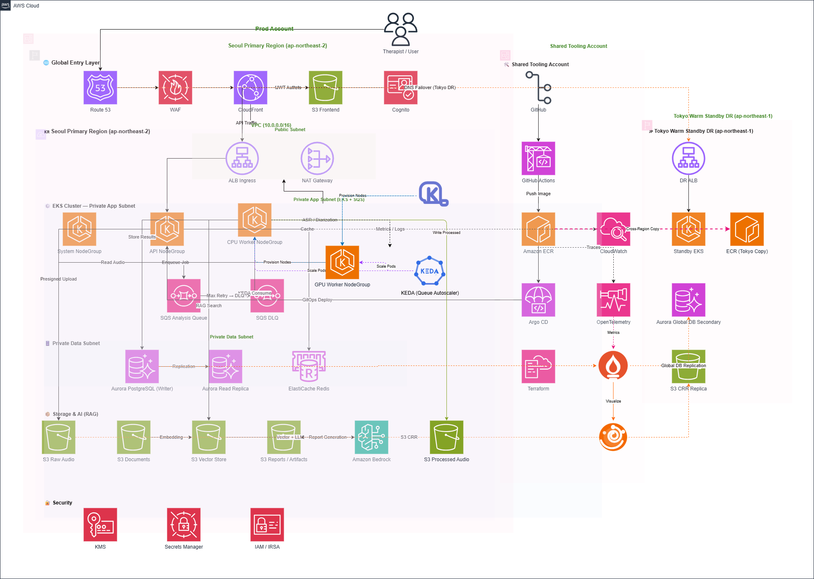

# UtterAI 인프라 환경 가이드

UtterAI 클라우드 인프라는 Dev와 Prod 두 환경으로 완전히 분리하여 운영한다.

---

## 환경별 문서

- [Dev 환경 가이드](./dev/README.md)
- [Prod 환경 가이드](./prod/README.md)
- [Monitoring Runbook](./monitoring-runbook.md)

---

## AWS 계정 구조

```text
┌─────────────────────┐   ┌─────────────────────┐   ┌─────────────────────┐
│   Dev Account       │   │  Shared Tooling      │   │   Prod Account      │
│                     │   │  Account             │   │                     │
│  - EKS (dev)        │   │  - GitHub Actions    │   │  - EKS (prod)       │
│  - Aurora (dev)     │   │  - ECR               │   │  - Aurora (prod)    │
│  - Redis (dev)      │   │  - Argo CD           │   │  - Redis (prod)     │
│  - S3 (dev)         │   │  - Terraform         │   │  - S3 (prod)        │
│  - SQS (dev)        │   │  - CloudWatch        │   │  - SQS (prod)       │
│  - Cognito (dev)    │   │  - Grafana           │   │  - Cognito (prod)   │
└─────────────────────┘   └─────────────────────┘   └─────────────────────┘
                                                              │
                                                     Tokyo DR (ap-northeast-1)
                                                     ┌────────────────────┐
                                                     │  - Standby EKS     │
                                                     │  - Aurora Global   │
                                                     │  - S3 CRR          │
                                                     │  - ECR Copy        │
                                                     └────────────────────┘
```

---

## Dev vs Prod 핵심 차이

| 항목 | Dev | Prod |
|---|---|---|
| **AWS 계정** | Dev 전용 계정 | Prod 전용 계정 |
| **도메인** | `dev.utterai.com` / `api.dev.utterai.com` | `utterai.com` / `api.utterai.com` |
| **리소스 Prefix** | `utterai-dev-` | `utterai-prod-` |
| **VPC CIDR** | `10.10.0.0/16` | `10.0.0.0/16` |
| **AZ 수** | 2개 | 3개 |
| **EKS NodeGroup** | System/API/CPU Worker/GPU Worker (최소 사양) | System/API/CPU Worker/GPU Worker (운영 사양) |
| **API 노드 타입** | `t3.medium` | `t3.xlarge` |
| **CPU Worker 타입** | `t3.large` | `c5.2xlarge` |
| **GPU Worker 타입** | `g4dn.xlarge` (평소 0대) | `g4dn.xlarge` |
| **노드 스케일링** | Karpenter NodePool (CPU/GPU Worker) | Karpenter NodePool (CPU/GPU Worker) |
| **KEDA minReplica** | 0 (비용 절감) | 1 |
| **GPU Worker Spot** | 허용 (비용 절감) | 금지 (On-Demand only) |
| **백엔드 Pod 수** | 1 (최대 2) | 3 (최대 10) |
| **Aurora 타입** | `db.t3.medium` | `db.r6g.large` |
| **Aurora 구성** | Single-AZ, Writer 1개 | Multi-AZ, Writer 1 + Reader 1 |
| **Redis 타입** | `cache.t3.micro` | `cache.r6g.large` |
| **Redis 구성** | 단일 노드 | Primary + Replica, Multi-AZ |
| **S3 버전 관리** | 비활성화 | 활성화 |
| **KMS 암호화** | S3 기본 암호화 | 서비스별 KMS Key |
| **WAF** | 없음 | 활성화 |
| **DR (Tokyo)** | 없음 | Aurora Global DB + S3 CRR + Standby EKS |
| **Bastion 접근** | 허용 | 금지 (SSM 경유) |
| **LOG_LEVEL** | `DEBUG` | `INFO` |
| **Auto-Sync (Argo CD)** | 활성화 | 비활성화 (수동 Sync) |
| **Terraform State** | S3 (dev 버킷) | S3 (prod 버킷, KMS 암호화) |
| **DB 초기화** | 허용 | 절대 금지 |

---

## 아키텍처 다이어그램



---

## Shared Tooling Account 역할

GitHub Actions, ECR, Argo CD, Terraform, CloudWatch, Grafana는 Dev/Prod와 분리된 Shared Tooling Account에서 관리한다.

- CI/CD 도구 침해 시 Prod 데이터 직접 접근 불가
- Dev/Prod 두 환경을 하나의 Tooling Account에서 통합 관리
- Argo CD → Prod Account EKS 배포는 Cross-Account IAM Role 사용

---

## 공통 아키텍처

두 환경 모두 동일한 아키텍처 구조를 따른다.

```text
User
  -> Route 53
  -> CloudFront
  -> WAF (Prod만)
  -> ALB Ingress
  -> EKS Backend API Pod
       |-- Cognito (JWT 검증)
       |-- Aurora PostgreSQL
       |-- ElastiCache Redis
       |-- S3 (Presigned URL)
       |-- SQS (분석 요청)
       |-- AI Service (Callback 수신)
       |-- CloudWatch / OTel
       |-- Secrets Manager
```

---

## 배포 브랜치 전략

| 브랜치 | 배포 환경 | 배포 방식 |
|---|---|---|
| `feature/*` | 없음 | PR 테스트만 |
| `main` + `overlays/dev` | Dev | 자동 배포 (Auto-Sync) |
| `main` + `overlays/prod` | Prod | 수동 배포 (Argo CD 수동 Sync) |

---

## Terraform 구조

```text
terraform/
├── modules/          # 공통 모듈 (vpc, eks, aurora, redis, s3, sqs, cognito, iam, kms, waf)
└── environments/
    ├── dev/          # Dev 환경 변수값 및 모듈 조합
    └── prod/         # Prod 환경 변수값 및 모듈 조합
```

Dev와 Prod는 동일한 Terraform 모듈을 사용하고, `environments/{env}/terraform.tfvars`에서 인스턴스 크기, AZ 수 등 값을 다르게 주입한다.
